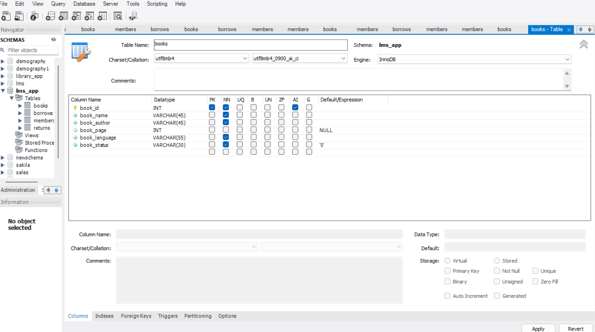

# Libraray-Management-System
Author-Saurabh Upadhyay
 
 
 

Welcome to the Library Management System project! This Python-based application, utilizing MySQL for database management and the Tkinter library for the graphical user interface, is designed to streamline the operations of a library. Whether you're managing a personal collection or overseeing a larger library, this system aims to provide an efficient and user-friendly solution.
 
 
Key Features
 
Add Book: Easily add new books to the library database with the click of a button.
 
Add Member: Keep track of library members by adding their information to the system.
 
Return Book: Manage book returns efficiently through a dedicated button.
 
Give Book: Facilitate the process of lending books to members.
 
Search Bar: Utilize the search bar to quickly find specific books within the library.
 
List Book: Choose from various options, such as viewing all books, borrowed books, or available books.
 
Statistics: Gain insights into the library's performance with a dedicated statistics feature.
 
 
Technologies Used
 
Python: The core programming language for the application's logic and functionality.
 
MySQL: A relational database management system used to store and manage book and member information.
 
Tkinter: A Python library for creating interactive and visually appealing graphical user interfaces.
 
 
 
1. Books Table:
 
Purpose: This table is designed to store information about the books available in the library.
 
Fields:
 
book_id (Primary Key): Unique identifier for each book.
 
title: Title of the book.
 
author: Author of the book.
 
language: langauge in which the book is available in library.
 
book_status: Indicates whether the book is available for borrowing.
 

 
Why Create It: The Books table is essential for maintaining a comprehensive catalog of all available books in the library, along with their key details.
 
 
2. Members Table:
 
 
Purpose: This table stores information about the members or patrons of the library.
 
Fields:
 
member_id (Primary Key): Unique identifier for each member.
 
member_name: Name of the member.
 
phone: Phone number of the member.
 
 
Why Create It: The Members table helps in managing and tracking the information of individuals who are registered library members, facilitating efficient communication and record-keeping.
 
 
3. Borrows Table:
 
 
Purpose: This table is responsible for recording instances when a member borrows a book from the library.
 
Fields:
 
borrow_id (Primary Key): Unique identifier for each borrowing transaction.
 
bmember_id (Foreign Key): Links to the Members table, indicating which member borrowed the book.
 
bbook_id (Foreign Key): Links to the Books table, indicating which book was borrowed.
 
 
Why Create It: The Borrows table helps in tracking the borrowing history of members, allowing the library to monitor book availability and manage due dates effectively.
 
 
4. Returns Table:
 
 
Purpose: This table records instances when a member returns a borrowed book.
 
Fields:
 
return_id (Primary Key): Unique identifier for each return transaction.
 
rborrow_id (Foreign Key): Links to the Borrows table, indicating the original borrowing transaction.
 
rmember_id: indicating the original borrowing member_id.
 
return_date: Date when the book was returned
 
 
Why Create It: The Returns table complements the Borrows table, providing a log of returned books. It helps in calculating any overdue fines, updating book availability, and maintaining accurate records of the library's collection.
 
 
